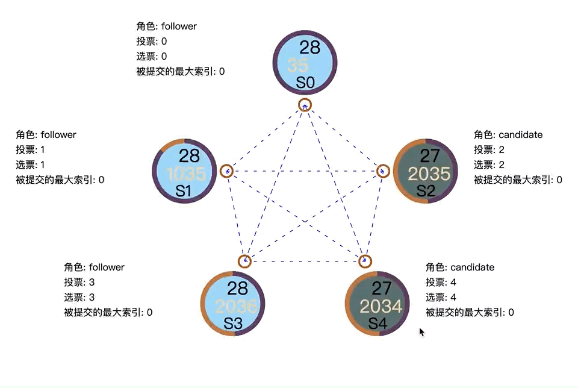

# 一个简单的raft实现

这里是前端实现,后端地址:https://github.com/inksnw/simple-raft

运行方法

```bash
go run main.go
# 访问 http://127.0.0.1:8000
```

参考信息

https://zhuanlan.zhihu.com/p/86616572

https://github.com/visualizit/vizit


